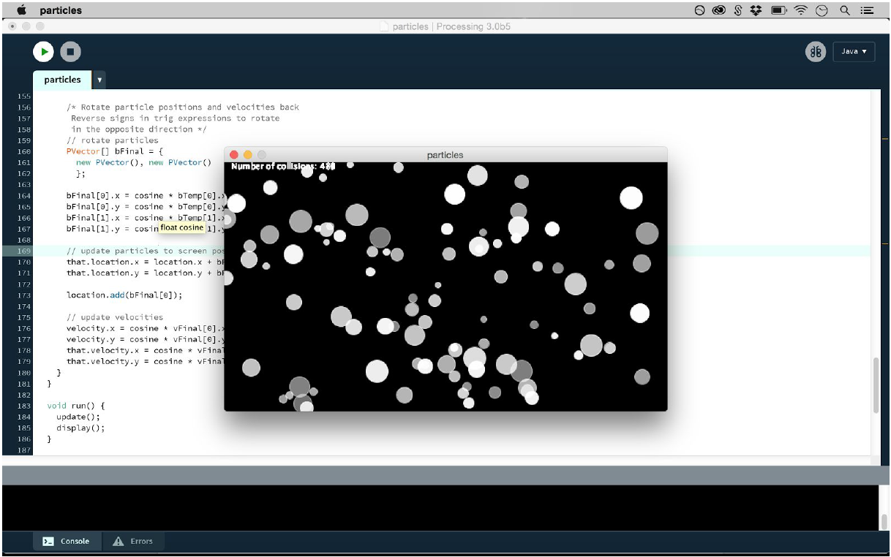
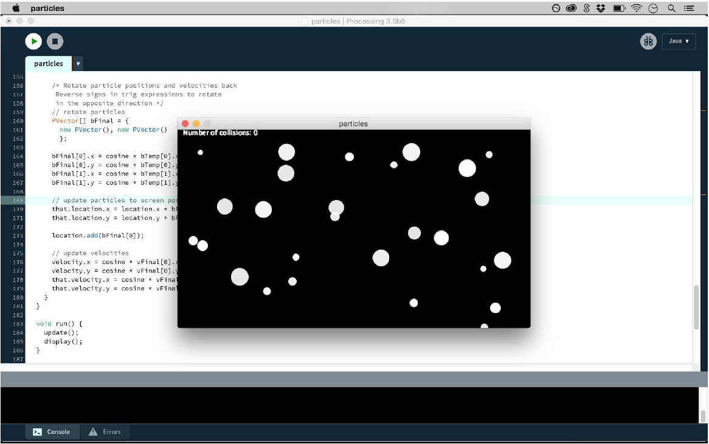

# CS4300-Particle-System
To write this rigid body particle system, I used Processing 3.0 with Java. No additional
plugins were used. 

A full code walkthrough is available in rigidbodies.pdf at the top level of this repo.

Some screetshots of the simulation:

